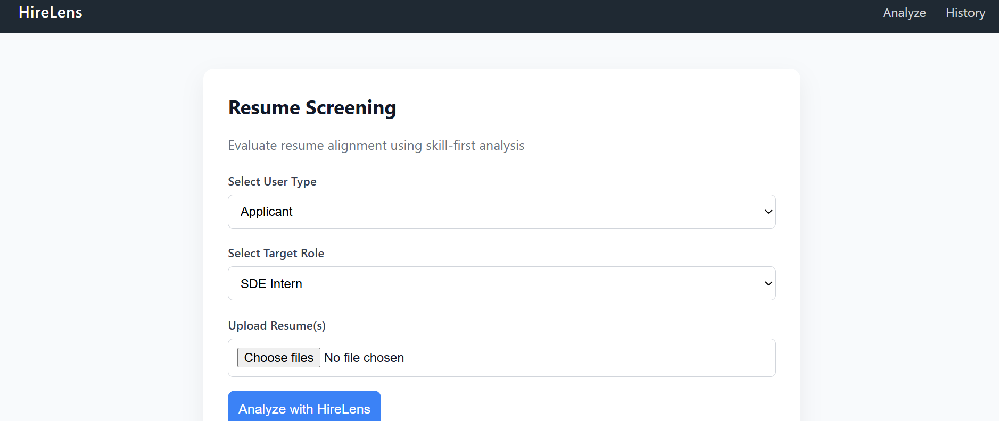
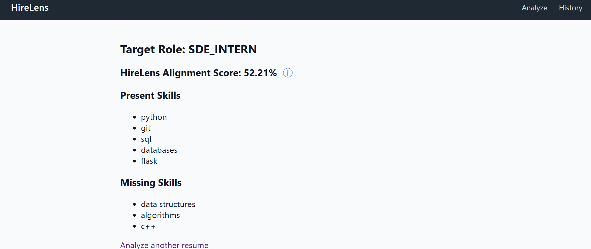
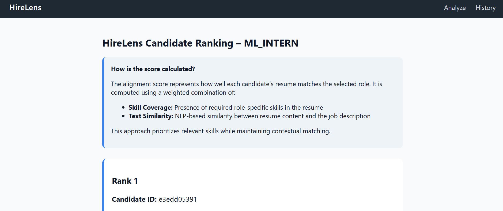
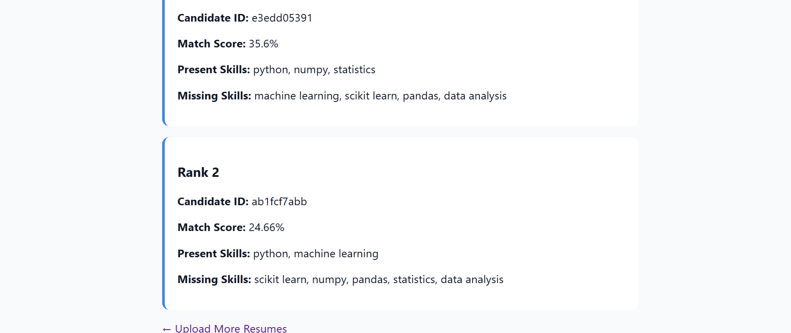

# HireLens

HireLens is a skill-first, explainable resume screening platform designed for both applicants and recruiters.  
It evaluates resume–job alignment using a combination of explicit skill coverage analysis and NLP-based text similarity, providing transparent and interpretable match scores.

---

## 🚀 Features

### 👩‍🎓 Applicant Workflow
- Upload a resume (PDF) and select a target role
- Receive a **Resume–Job Alignment Score**
- View:
  - Present skills
  - Missing skills
- Hover-based score explanation for transparency

### 🧑‍💼 Recruiter Workflow
- Upload **multiple resumes** for a given role
- Automatically **rank candidates** based on alignment score
- View skill gaps for each candidate
- Centralized explanation of scoring logic
- Content-based resume hashing to uniquely identify resumes

---

## 🧠 Scoring Methodology

HireLens avoids relying solely on raw text similarity, which can be misleading due to differences in resume and job description length.

The final alignment score is computed as a **weighted combination** of:

- **Skill Coverage (Primary):**
  Percentage of required role-specific skills present in the resume

- **Text Similarity (Secondary):**
  TF-IDF + cosine similarity between resume content and the job description

This approach produces more realistic and interpretable scores compared to raw NLP similarity alone.

---

## 🧩 Supported Roles

- **SDE Intern**
- **ML Intern**

Each role has:
- A dedicated job description
- A curated list of required skills
- Role-specific score explanations

---

## 🛠️ Tech Stack

- **Backend:** Flask, Python
- **Machine Learning / NLP:** scikit-learn (TF-IDF, cosine similarity)
- **Data Processing:** NumPy
- **Database:** SQLite
- **Frontend:** HTML, CSS, Jinja2
- **Other:** PDF text extraction, virtual environments

---

## 📁 Project Structure

```
hirelens/
├── app.py
├── model/
│ ├── matcher.py
│ ├── skill_gap.py
│ └── skills.py
├── utils/
│ ├── database.py
│ └── text_extractor.py
├── data/
│ ├── job_descriptions/
│ │ ├── sde_intern.txt
│ │ └── ml_intern.txt
│ └── uploads/
├── templates/
│ ├── layout.html
│ ├── index.html
│ ├── result.html
│ └── recruiter_result.html
├── static/
│ └── style.css
├── requirements.txt
└── README.md
```

---

## 📸 Screenshots

### Home Page – Resume Upload
User-friendly interface for selecting user type, target role, and uploading resume(s).



---

### Applicant Result – Alignment Score & Skill Gap
Applicants receive an explainable alignment score along with present and missing skills.



---

### Recruiter View – Candidate Ranking

Recruiters can upload multiple resumes and view ranked candidates based on alignment score.

**Score Explanation (Top Section):**  


**Ranked Candidates List:**  



---

## ⚙️ Setup Instructions

### 1️⃣ Clone the repository
```bash
git clone https://github.com/Aryanka26/hirelens.git
cd hirelens
```
### 2️⃣ Create and activate a virtual environment
```bash
python3 -m venv venv
source venv/bin/activate
```
### 3️⃣ Install dependencies
```bash
pip install -r requirements.txt
```
### 4️⃣ Run the application\
```bash
python app.py
```
The app will be available at:
```
http://127.0.0.1:5000/
```

---

## 🎯 Design Philosophy

- **Skill-first evaluation** over keyword stuffing  
- **Explainable scoring** to improve user trust and interpretability  
- **Separate applicant and recruiter workflows** to reflect real ATS use cases  
- Clean, professional UI aligned with recruiter-facing tools  

---

## 🔮 Future Improvements

- Recruiter-defined custom job roles and skill requirements  
- Learning recommendations based on identified skill gaps  
- Export ranked candidates as CSV for recruiter workflows  
- Deployment on a cloud platform (e.g., Render / Railway)  

---

## 📌 Note

HireLens is an educational project built to demonstrate applied NLP, backend system design, and product thinking.  
It is **not intended to replace production-level ATS systems**, but to simulate their core evaluation logic in an interpretable manner.

---

## 👤 Author

**Aryanka Shende**  
B.Tech, Materials Science and Engineering  
Indian Institute of Technology, Mandi


- 
